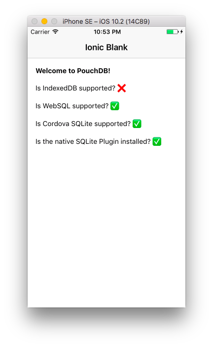

pouchdb-ionic-2-hello-world
=====================

This is a "hello world" Ionic 2 app, using PouchDB.

The app was built with ionic CLI v2.2.1, using this command:

    ionic create --v2 pouchdb-ionic-2-hello-world

Then I installed PouchDB:

    npm install pouchdb-browser --save

(I used the `pouchdb-browser` package because we don't need Node/LevelDB dependencies to run in Ionic,
so we can skip installing the Node dependencies. You could also use the `pouchdb` package.)

Then I imported PouchDB in JavaScript:

```js
import * as PouchDB from 'pouchdb-browser';
```

Then I modified `home.ts` and `home.html` to show some PouchDB stats.

If you run this app using `ionic run ios`, you should see:

